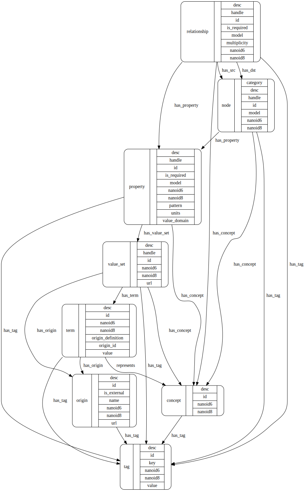

# Bento Meta DB 

[Example Queries](#example-queries)

The metamodel database (MDB) records
- node/relationship/property structure of models;
- the official local vocabulary - terms that are employed in the backend data system;
- synonyms for local vocabulary mapped from external standards; and
- the value sets for properties with enumerated value domains, and data types for other properties.

The production instance of MDB will contain the "official" representation of a data model, in that it will record the curated external terminology mappings and official sets of valid terms for each relevant property. In this way, the MDB is an extension of the [MDF](https://github.com/CBIIT/bento-mdf) for any model it contains.

As the central location for official mappings to external vocabularies, the MDC can (should) be used as part of software modules that convert between the data physically stored in the production database and external standards. For example, an API known as the Simple Terminology Service [STS](https://github.com/CBIIT/bento-sts), using MDB as its backend, is used for simple queries about a given model and validation of incoming data.

## Programming APIs

APIs for working with the MDB are available in [Python](./python) and [Perl](./perl). 

[See the Python documentation.](https://cbiit.github.io/bento-meta/)

## Structure

The MDB is formulated as a [graph model](https://en.wikipedia.org/wiki/Graph_database#Labeled-property_graph). This model contains more structure than will be exposed by the Simple Terminology Service (in order to keep it Simple). Other services can be built on the DB to perform translations, add terms and mappings, create visualizations, and other functions.

The metamodel is described in a [Model Description File](./metamodel.yaml). Documents and tools for this format are at [bento-mdf](https://github.com/CBIIT/bento-mdf).

The MDB model contains the following nodes.

### Node 

A node with the label "node" in the MDB represents a model node: for example, a `Diagnosis` node. 

### Relationship

A Relationship _node_ represents a model _relationship_; for example, a model may entail a relationship `has_diagnosis` from a `Case` node to a `Diagnosis` node. To represent this in the metamodel, a Relationship node is created with `handle` = `has_diagnosis`, along with a link `has_src` to the `Case` node, and a link `has_dst` to the `Diagnosis` node. A Neo4j relationship is also created between Node nodes, with a type = `underscore+<relationship handle>`. In the example, `Case` and `Diagnosis` nodes would be linked by a `_has_diagnosis` relationship.

### Property

A Property node in the Model DB  represents a property of a model node: for example, the `disease` property of a `Diagnosis` node. 

### Concept

A Concept node represents an intellectual concept. It is abstract, in that it has no human readable name as such; it will however have a unique ID. The Concept node can be thought of as a connecting point for sets of Terms that are identical in meaning (are _synonymous_).

### Origin

An Origin node represents an entity (institution, internal project, defined standard, recognized body, public database) that defines and/or promulgates a terminology and represents it authoritatively.

### Term > Value

A Term node is an instance of encoding (a "representation") of a concept. Each Term node is linked to at least one Origin node, which represents the entity that provides the term value/code and/or the term semantics.

The value property of a Term node is the string representation of the term. This is a token that, for example, may be physically stored in a database as a datum.

### Value Set

A Value Set node aggregates (links to) a number of Term nodes that define the list of acceptable values for a property slot. The value set does not directly aggregate Concepts; it is meant to define the pragmatic set of valid representations of values for a property.

### Concept Group 

A Concept Group node aggregates (i.e., links to) Concept nodes. Concept Groups might be implicit. A Value Set node, for example, implicitly defines a Concept Group - the set of those Concept nodes that are linked to the Term nodes aggregated by the Value Set.

## Information NOT Captured in the MDB

Semantic structure (for example, hierarchical groupings of concepts, or other "facts" or "predicate" relationships), besides synonymy and value set grouping, is not intended to be represented in the MDB. To the extent this information exists, it will be accessible in external services via the relevant Origins (e.g., NCI Thesaurus). External model topologies need not be concordant with the model structure represented in the MDB.

## Reading and Writing to the MDB

An object model of the MDB in Perl, [Bento::Meta](/perl), is available and recommended.

Notes regarding loading the MDB with model description files, and creating external mappings, are [here](./loaders/load-meta.md). See [loaders](./loaders) for a number of initial loading scripts.

## Example Queries

* What are the nodes in the ICDC model?

        match (n:node {model:"ICDC"}) return n;

* What are the nodes in the CTDC model?

        match (n:node {model:"CTDC"}) return n;

* What are the acceptable values for the ICDC "body_system" property?

        match (p:property {handle:"body_system", model:"ICDC"})-->(:value_set)-->(t:term)
           return t.value;

* Are there properties that have the same name ("handle") in both ICDC and CTDC ?

        match (p:property {model:"ICDC"}), (q:property {model:"CTDC"}) where p.handle=q.handle
          return p.handle;

* How many nodes with the same handle appear in both models?

        match (n:node) with count(n) as ct, n.handle as handle where (ct > 1) return handle;

* Do those nodes refer to the same semantic concept, or different concepts?

        match (n:node) with count(n) as ct, n.handle as handle where ct>1
          match (n:node)-[:has_concept]->(c) where n.handle=handle return n,c;

* What terms are synoymous with the ICDC term `adverse_event_grade`, and where do those terms come from?

        match (:term {value:"adverse_event_grade"})-->(c:concept) with c match (c)<--(t:term)-->(o:origin) return t.value,o.name;

* What's the NCIT concept code mapped to the ICDC term `ae_dose`?

        match (:term {value:"ae_dose"})-->(c:concept)<--(t:term)-->(o:origin {name:"NCIT"}) return t.origin_id;

* What BRIDG entities are mapped to the ICDC _relationship_ `member_of`? What are the relevant BRIDG mapping paths?

        match (:relationship {handle:"member_of"})-->(c:concept)<--(t:term)-->(o:origin {name:"BRIDG"}) return t.value, t.mapping_path

