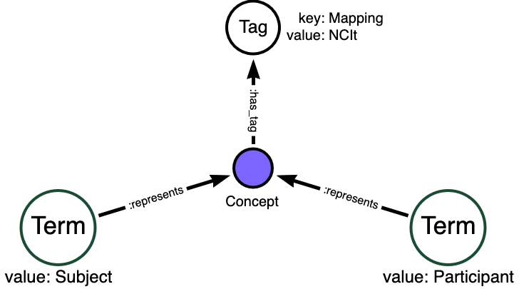

MDB Conventions and Patterns
==========================================

Conventions and software tools based on the following principles and
guidelines are necessary to enable maintenance of an MDB. The
organization of data of the MDB instance needs to be stable and
predictable so that data does not get lost, incorrectly duplicated,
or mutated.

As the data grows, and especially as the interconnections
between different models and mappings into common vocabularies
increase, the database will become less and less amenable to manual
updates via Cypher statements or one-off scripts. At the same time, as the
complexity grows, so does the utility and value of the MDB, as long as
it remains consistent -- so that queries always return what the schema
says they will return.

To maintain this kind of consistency, but also treat the MDB as a
dynamic store of information that is amenable to frequent change,
robust software tools for updating the database are necessary. These
tools alleviate the need for SMEs and engineers to remember the schema
and prevent shortcuts that would affect the outcome of standard
queries that are based on the expectations set by the schema.

This principle does *not* say that *additional* nodes, properties, or
relationships cannot ever be added to an MDB. Reasons of performance
tuning, tagging, indexing, setting "placeholders" or "cursors", are
all valid enhancements or temporary modifications. If such
enhancements make sense to add to the general MDB schema, then they
should be so added. The key question to ask before making permanent
enhancements should be: *Will they break existing queries?* If so,
then discussion, deprecation and update planning is necessary.

Temporary structural additions to the database to facilitate
maintenance or fixes may be appropriate. It is critical to plan ahead,
so that the database admin can back completely out of such modifications after
they have performed their function.

MDB entity properties required for consistency
______________________________________________

The MDB schema is flexible, but the following properties and entities
are critical for its functionality.

All entities need to posses a non-null *nanoid*. This is a six
character, alphanumeric random identifier, which can be generated with
the ``nanoid`` package in various languages (e.g., `for python <https://github.com/puyuan/py-nanoid>`_). Once set for an entity in an MDB
instance, it should not be changed, even when other properties are
updated, added, or removed. The nanoid (plus a version string,
possibly) should uniquely identify all single Neo4j nodes in the
database instance.

An important reason for maintaining the nanoid on an entity through
changes (and also to retire a nanoid if an entity is removed) is that
it serves as a handle or short-cut for the Simple Terminology
Service (`STS <https://github.com/CBIIT/bento-sts>`_. Appending a nanoid to the STS /id endpoint must always return that
entity as a JSON document. Versions of an entity are allowed, but a
version string should qualify the original nanoid for retrieval; new
versions of an existing entity should not receive a new nanoid.

Node, Relationship, and Property entities must all possess a non-null ``model``
property, set to the model the entity is describing. For each unique
value of the ``model`` property, a corresponding Model entity (Neo4j
node) should exist, that describes the model further. A Neo4j
relationship between model entities and the corresponding Model node
are not necessary or expected under the schema.

Value Set and Term entities are intentionally _not_ associated
directly with any model - this enables the idea of reuse of the same
terms across different models. However, every Term must have an
_origin_ property that indicates an authoritative source for the term
and its meaning. 

Value Sets may have an origin property, if the set itself is a product
of an external authority. An example would be the value domain for
ethnicity according to the caDSR, with public id 2016566, consisting
of five terms.

MDB indexes needed for additional functionality
_______________________________________________

For integration with the STS, and for performance, the Neo4j instance
of an MDB requires certain indexes to be established. These are
specified in `these Cypher statements <githubref>`_. The primary
requirement is that fulltext, Lucene-based indexes should be created
on entity ``description`` and Term ``origin_definition`` properties to
enable "search box" like queries over the the entire graph. Regular
btree indexes on entity ``handle`` and Term ``value`` properties are also
highly recommended for fast query responses.

Conventions for consistent and idempotent updates
_________________________________________________

Uniqueness and Existence of Entities
^^^^^^^^^^^^^^^^^^^^^^^^^^^^^^^^^^^^

In an unversioned MDB, the following combinations of properties point
to unique graph nodes which must exist. (The notation below is based
on `Cypher <https://neo4j.com/docs/cypher-manual/current/>`_.)

* *Node*: For `(n:node)`, the combination `[n.model, n.handle]` is unique.
  * That is, one and only one graph node exists with these values of `n.model` and `n.handle`.

* *Property (uniqueness)*: For `(p:property)` with `(e)-[:has_property]->(p)`, the combination
  `[p.model, p.handle, e.handle]` is unique.

  * One and only one graph node `p` exists satisfying this condition. `e` is a node or relationship, and `e.model == p.model` must hold.

* *Property (distinctness)*: For `(p:property)` with `(e)-[:has_property]->(p)` and `(q:property)` with `(f)-[:has_property]->(q)`, if `e != f`, then `p != q`.

  * In other words, properties associated with different entities are always distinct; properties with the same handle must not be "reused" among different nodes or relationships, even in the same model. An implication of this requirement is that nodes or relationships form a namespace that distinguish their properties from others.
    
* *Relationship*: For `(r:relationship)` with `(s:node)<-[:has_src]-(r)-[:has_dst]->(d:node)`, the combination `[r.model, r.handle, s.handle, d.handle]` is unique.

  * One and only one graph node `r` exists satisfying this condition, and `r.model == s.model == d.model` must hold.

* *Value Set*: For `(p:property)` with `p.value_domain == “value_set”`, then one and only one value_set `v` with `(p)-[:has_value_set]->(v:value_set)` must exist.
  
* *Term*: For a term `(t:term)`, only one graph node with `[t.origin_name, t.origin_id, t.origin_version]` may exist, *even in a versioned MDB*.
  
* *Concept*: For any `(c:concept)` and `(k:concept)` where `(n)--(c)` and `(n)--(k)` return exactly the same graph nodes `[n1, n2, ...]`, one of `c` or `k` should be removed from the database.
  
* *Tag*: For two tag nodes, all of whose properties except nanoid are identical in key and value, and which are linked to exactly the same graph nodes, one must be removed.

* *Nanoid*: Each unique unversioned graph node as defined above must have a unique nanoid.

  * The nanoid *shall not change* when a graph node is updated, provided above conditions remain satisfied upon update.

  * If an existing MDB graph node is changed such that that node *no longer satisfies* its defining condition as above, it *must receive a new nanoid*. The old nanoid is retired and should not be used again.

  * In a versioned MDB, then the uniqueness conditions above are relaxed modulo the entity properties `_to` and `_from`. The nanoid *must be the same* among graph nodes that represent different versions of unique unversioned graph nodes as defined above.

Some implications of these formal rules:

* Handles are not unique identifiers; there can be many entities with the same handle for nodes, relationships, and properties.

Handles in combination with other properties can be unique. The model and handles can be considered to define namespaces in which qualified names point to unique MDB graph nodes. Example: `ICDC.demographic.breed` can represent the property “breed” of the node “demographic” in the ICDC data model. This would correspond to a property node with a persistent nanoid in the MDB.

* Graph nodes which meet the conditions above can be thought of as playing a given semantic role in a specific context. They represent an interaction between a concept and a model.

Graph Patterns for Representation
_________________________________

"Reuse" of Semantic Roles in MDB
^^^^^^^^^^^^^^^^^^^^^^^^^^^^^^^^

When creating a data model for a specific purpose, it is often desirable to make use of semantic concepts that have already been defined elsewhere. This is the case when the model needs to comply with a external standard, or when the system being modeled must interoperate with peers or within a larger system. Including an externally defined semantic element in a new data model is sometimes called *reuse*. 

In an MDB, the reuse of semantic concepts *among different models* is expressed by linking all graph nodes playing the same semantic role to a common :ref:`Concept node <concepts>`. Rather than creating a universal “demographic” node and connecting every model needing that concept to that node, each model that needs one gets its own “demographic” node. The Concept node only acts as a "hub". A Term node can be used to annotate a Concept node with the details that point to an external standard (the origin or authority, the definition, and identifier).

This figure exemplifies the MDB pattern for representing reuse of an external semantic concept.

.. image:: _static/mdb-patterns.png
	   :align: center
	   :alt: Concept reuse in an MDB

Note that a Term node that annotates a Concept node is linked by a `:represents` relationship.

Terms themselves can also be components of Value Sets. Terms and Value Sets are explicitly intended to be reused among models within an MDB. A Term can represent an acceptable value, and Value Sets are hubs that aggregate Terms into an acceptable value list. The following figure indicates the graph patterns for reuse of both Terms and Value Sets in an MDB.

.. _term_valueset_pattern:
.. image:: _static/mdb-patterns-2.png
	   :align: center
	   :alt: Term and Value Set reuse in an MDB

Here, the two Properties `primary_site` and `anatomic_location` share a Value Set, while the Value Set for Property `sample_type` borrows the Term `blood`.

Encoding "Mappings"
^^^^^^^^^^^^^^^^^^^

An MDB is intended to store both models and inter-model relationships. An important example of such a relationship can be called *synonymy* - an assertion that two or more entities are semantically equivalent. In the context of data transformation, data values (Terms) valid under one model can be mapped to synonymous values in a different model. An MDB can store such mappings, and calls to an MDB can provide the backend to tools that perform transformations.

Assertions that terms are synonymous are made by experts or groups, who can differ in opinion. An MDB can also tag mappings according to the source or authority. This capability can, for example, drive a tool that performs transformation according to a specific authority's mappings.

The MDB pattern for asserting synonymy according to specific expert source is exemplified in this figure.

Models
^^^^^^

Data models under our management are generally maintained as `MDF <https://github.com/CBIIT/bento-mdf>`_ files
in open GitHub repositories. Data SMEs are able to make changes and
updates to models as necessary, and GitHub tracks and remembers all
changes. Branches created for development are extremely useful and
enable SMEs to work productively with engineers on upcoming features
while the latest production model remains accessible for users and the
production data system. 

Tapping into this existing work process is a natural place to
incorporate systematic updates to the MDB. Once model changes are
approved for production, the MDF can be made part of a GitHub
release. CI/CD processes (e.g., GitHub Actions or Jenkins) can
automatically pull new MDF releases and update the MDB with changes.

For this process to be deterministic, conventions must be established
that unambiguously define when differences between the MDF model and the
corresponding MDB model represents intended updates, and when they
indicate an error in the MDF. To do this, the intention of the SME
must be made clear in the data (i.e., the model description file)
itself. There also should be a way to back out of at least one update
if necessary.

In our system, we use the `Liquibase <https://www.liquibase.com/>`_ platform, along with the Neo4j `Liquibase plugin <https://neo4j.com/labs/liquibase/docs>`_, to maintain auditability and reversibility of changes. This is facilitated by the Python package `liquichange <https://github.com/nelsonwmoore/liquichange>`_. More details can be found at the `bento-mdb <https://github.com/CBIIT/bento-mdb>`_ repository.

Terms
^^^^^

*WIP*

